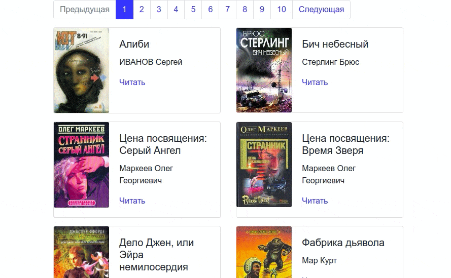

# Офлайн-библиотека
  

Скрипт запускает сайт с книгами.  
Книги были скачанны при помощи [парсера книг с сайта tululu.org](https://github.com/antauren/books-library-restyle/).

[Пример работы сайта](https://antauren.github.io/books-library-restyle-2/pages/)   


### Установить зависимости

Python3 должен быть уже установлен.   
Затем используйте `pip` (или `pip3`, есть конфликт с Python2) для установки зависимостей:
```
pip install -r requirements.txt
```


### Примеры запуска:
```
python render_website.py
```
Сайт будет доступен по адресу: http://127.0.0.1:5500/

### Цель проекта

Код написан в образовательных целях на онлайн-курсе для веб-разработчиков 
[dvmn.org](https://dvmn.org/modules/website-layout-for-pydev/lesson/books-library-restyle-2/).
